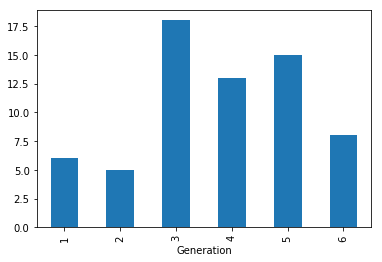
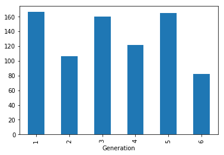

```python
%matplotlib inline
import pandas
import matplotlib as mp


df = pandas.read_csv('Pokemon.csv')
df = df[['Legendary','Generation']]
legendaries = df[df.Legendary==True]


mygroup = legendaries.groupby('Generation')
mygroup.size().plot(kind='bar')
mygroup.size().to_frame('Number of Legendaries')
```


<div>
<style>
    .dataframe thead tr:only-child th {
        text-align: right;
    }

    .dataframe thead th {
        text-align: left;
    }

    .dataframe tbody tr th {
        vertical-align: top;
    }
</style>
<table border="1" class="dataframe">
  <thead>
    <tr style="text-align: right;">
      <th></th>
      <th>Number of Legendaries</th>
    </tr>
    <tr>
      <th>Generation</th>
      <th></th>
    </tr>
  </thead>
  <tbody>
    <tr>
      <th>1</th>
      <td>6</td>
    </tr>
    <tr>
      <th>2</th>
      <td>5</td>
    </tr>
    <tr>
      <th>3</th>
      <td>18</td>
    </tr>
    <tr>
      <th>4</th>
      <td>13</td>
    </tr>
    <tr>
      <th>5</th>
      <td>15</td>
    </tr>
    <tr>
      <th>6</th>
      <td>8</td>
    </tr>
  </tbody>
</table>
</div>





```python
df = pandas.read_csv('Pokemon.csv')
df.groupby('Generation').size().plot(kind='bar',y='New Pokemon')
df.groupby('Generation').size().to_frame('Number of New Pokemon')

```


<div>
<style>
    .dataframe thead tr:only-child th {
        text-align: right;
    }

    .dataframe thead th {
        text-align: left;
    }

    .dataframe tbody tr th {
        vertical-align: top;
    }
</style>
<table border="1" class="dataframe">
  <thead>
    <tr style="text-align: right;">
      <th></th>
      <th>Number of New Pokemon</th>
    </tr>
    <tr>
      <th>Generation</th>
      <th></th>
    </tr>
  </thead>
  <tbody>
    <tr>
      <th>1</th>
      <td>166</td>
    </tr>
    <tr>
      <th>2</th>
      <td>106</td>
    </tr>
    <tr>
      <th>3</th>
      <td>160</td>
    </tr>
    <tr>
      <th>4</th>
      <td>121</td>
    </tr>
    <tr>
      <th>5</th>
      <td>165</td>
    </tr>
    <tr>
      <th>6</th>
      <td>82</td>
    </tr>
  </tbody>
</table>
</div>




